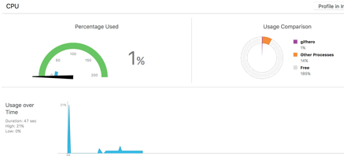
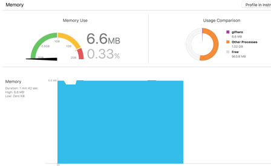

 


GifHero is a library for iOS that renders animated GIF natively.

Here is an example of GifHero in action


# Install
### CocoaPods
You can get GifHero easily with CocoaPods.

Add to your Podfile
```
pod 'GifHero'
```
Run installation
```
> pod install
```
If you are wondering what is CocoaPods take a look at: [https://cocoapods.org](https://cocoapods.org)

# Usage
### GifView
GifView is your new best friend for adding GIF to your app

### Add GifHero
Once the Pod is installed import it in your project
```
import GifHero
```
Create a new GifView
```
let gifView:GifView = GifView()
addSubview(gifView)
```

### Load with name
GifView can load any GIF in your proyect by name
```
gifView.gifNamed = "pigJumping.gif"
```

### Load with URL
Additionaly GifView can load GIFs by URL
```
let url:URL = getSomeUrl()
gifView.url = url
```

### Layout
By default GifView uses layout constraints but if you feel like using autoresizing masks and rects
```
gifView.translatesAutoresizingMaskIntoConstraints = true
gifView.frame = CGRect(x:0, y:0, width:100, height:100)
```

### ContentMode
Initially GifView perserves aspect to fill content (`scaleAspectFill`), but aspect fit can be used too
```
gifView.contentMode = UIViewContentMode.scaleAspectFit
```

### Animation
GifView is initially paused to save resources, but it is as easy to start animating as this
```
gifView.animating = true
```

# Demo
Clone or download this repo, it contains a Demo App

# Features
■ Best performance you will find

■ Less memory usage

■ Minimum energy usage

■ Easy to implement

# Magic behind GifHero
GifHero combines CoreGraphics and ImageIO to optimize rendering GIF.

It preprocesses every frame, scaling and cropping if necessary, and does this exactly just once, so UIKit doesn't have to scale every frame, every loop of the animation; the final result is a significant drop in CPU usage and frees a lot of Memory by using the smallest images possible.

It is not necessary to wait for the preprocessing to finish, preprocessing happens in the background while animating the frames as soon as they are ready. Most of the cases the animation goes flawlessly without delays from the start.

There is a chance that while preprocessing a very big GIF with lots of frames the CPU usage starts to increase, but this will only by in the first stage, after this it should drop considerably.

Honestly, you won't find a more optimized GIF renderer out there, but don't take my word for it, download the demo app and try it for yourself.

Screens of performance while animating on the demo app




